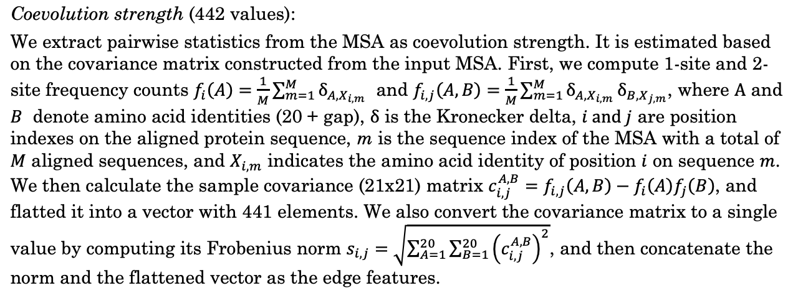

# Lab Notebook

## 09-09-2021(Thursday)
Right now my main focus is (at a high level) understanding how attention and transformers work in language models. I'm doign this by:

- reading the goodfellow deeplearning textbook
- blogposts()

Next, I'm going to try and figure out how to use pytorch 

## 09-13-2021(Monday)
- have read through most of the code for gMVP. Trying to run the initial data generation scripts, but missing input files. Rest of lab has not been super reponsive 
- I did find some processed files elsewhere on the `/data` drive ( in `hz**/protein/tf` ), that I might be able to use in the mean time to get something up and running 
- debating on whether or not to talk to yufeng about the lack of communication/documentation on the project. 

## 09-14-2021(Tuesday)
- realized I have no idea how to use pytorch, and will probably be more of a bottle neck, so i think it will be  a better use of my time to focus on that.
    - right now my plan is to go through tensorflow walkthroughs, but implement them in pytorch, so I will get exposure to both.
- Also, need to devote more time to the goodfellow book, bc I'm definitely feeling a bit lost math wise 

## 09-15-2021(Wednesday)
- Made a little more progress on pytorch today, but had a lot of course work and wasnt able to get into it as much 

## 09-(16, 17)-2021
Overall progress for the week
- realized me learning pytorch will be the biggest bottle neck for the project; have devoted most of time since tuesday on learning pytorch
- made decent progress, implmented a basic LSTM-rnn in colab (https://colab.research.google.com/drive/1HgkZ73uq3awAE1zllIALeKz8EetKfpk3)
- spoke with xiao, and she gave me the necessary files to both re-generate the training data and re-train the original gMVP tensorflow model
    - xiao mentioned that the gMVP model took a month(!) to train, so maybe talk to yufeng about using AWS (spot instances likely )
Tasks for next Week
- run the basic rnn we implemented in colab on the shen lab server, so we can get some practice setting up the env(maybe use docker?)
- implement a seq2seq model with attention 
- regenerate the training data and prepare it for use with pytorch 

Reflections for the week 
- I think I have enough time for research during the day, but need to careful about how I manage my time
- I have a little more sense about the gMVP project, and I am overall a little more comfortable working with yufeng
- one thing I have noticed is that the quality of code in the lab is pretty poor, which might not be what I want long term. 
- Another thing is that there doesn't seem to be a large sense of community in the lab; for the most part people kind of work on their own stuff and dont collaborate as much 

## 09/21/2021 (Tuesday)
- didn't have time to work on monday, was able to work on tuesday
- was able to run the `build_feature.py` and `build_tf_feature.py` scripts, but still missing the full training dataset. 
- have a pretty good sense about the model architecture, but need to read up a little more on attention

## 09/22/2021 (Wednesday )
- ran my simple RNN on `shannon`
- read through some blogs about attention. I have a much better understanding of attention and transformers, as well as the progression from the two

## 09/23/2021 (Thursday)
- Started implementing the EvolEncoder layer in pytorch, its going fairly well but havent testing it out yet 
- re-wrote `build_tf_feature` to work with pytorch

## Weekly reflection
- Things generally went better this week, I feel like I was in communication with the lab more 
- I spoke with yufeng(might have been last week) but it helped clear up a lot of confusion I had about the project
    - From the lab meetings, its clear yufeng knows what he's talking about, and gives good feedback 
- Conceptually, I think the project will need to move to something transformer based to stay competitive with the field. I should speak with yufeng about the long term focus of this direction

## 09/27/2021(Monday)
- skipped friday cause I was working on the symbols paper

### gMVP co-evolution calculation

re-implementing in pytorch, but wanted to get a better sense of how what exactly it means
This is from the paper  
Basically in plain english tho:
The input is an aligned MSA, with a total  $M$ sequences
Then for the position that corresponds to the variant, calculate the site frequency 

## 09/28/2021(Tuesday)
- grinded for 9 hours and got evol encoder layers and almost got MHA layer working
- still not following the linear algebra a ton, I think I need to spend a little time to review the tensor math 

## 09/29/2021(Wednesday)
- worked like 30 min, figured out how to use `torch.einsum` for tensor multiplication
- git repo for project is now `Shen_lab/pt_gMVP`

## 09/30/2021(Thursday)
- Finished implementing model in pytorch. Successfully ran a training epoch
- learned a little bit more on how to properly use cuda
- multi-gpu training was surprisingly easy to implement
- have not implemented the LR warmup or early stopping, will leave that for tomorrow 

## 10/01/2021(Friday)
Model trained( took about ~4.5 hrs on 3 1080's )
    - seems to be horribly overfit, the test loss seems to increase with time. 
    - going to try and train on a single GPU to see if thats the problem(I have a hunch )
    - also try adding dropout
    - if that's still failing, might be worthwhile going through the codebase and checking dimensions
    - also need to implement the learning rate decay (learning rate scheduling )
    - I'm also not totally sure that this is a true graphical neural network, the way the "graph" is constructed between each residue seems a bit honky
    - I think re-implemnting the model to better follow the paper (via my own interpretation) also seems like it would be a worthwhile idea. 
        - pulling out the co-evolution calculation into it's own thing might be helpful as well.    

Met with Yufeng today
    - direction for project is likely to use  
    - One possible direction is to try and regress allele frequency in addition to trying to predict 
        - Though this gives me the idea of a self supervised task (given the MSA + surrounding allele frequencies predict allele frequency of MASK )
    - Think I need to do some more background reading. Look at the REVEL paper
        - as a whole, I should spend more time reading papers, maybe try to hit at least one per week 
    - warming up to yufeng as a mentor, he's definitely gives you as much rope as you want, but seems to genuinely care about his students success

Other notes:
    - need to review both population genetics, and linear algebra. 
    - Ask bout auditing a linear algebra class next semester, or the summer?
    - potential population genetics courses
        - BIST P8149 Human Population Genetics
        - BIOL W6560 Human Evolutionary Genetics
Overall thoughts on the week 
    - Had my first "grad student" amount of time working (8:30-7) on tuesday, wasn't too bad
    - Not feeling any burnout really, more slowly getting used to working more 

## 10/08/2021(Friday)
I dont think daily updates are the way to go, so lets try weekly updates( I'm usually pretty burnt by friday afternoon anyways so I'll have time)

### Overall Lab Progress
- Have a model thats working with decent testing accuracy. 
- Need to add some more documentation to code base, but still waiting for a little more stability 
- Wrote more notes in the model repo.

## Overall thoughts on the week 
- Went pretty well, had to do a bunch of stuff for symbols, but made good progress for lab. 
- looks like tues/thurs are my heavy lab days,
- interacting with the lab a little more which is good. 
- idk man it was a pretty good week 

